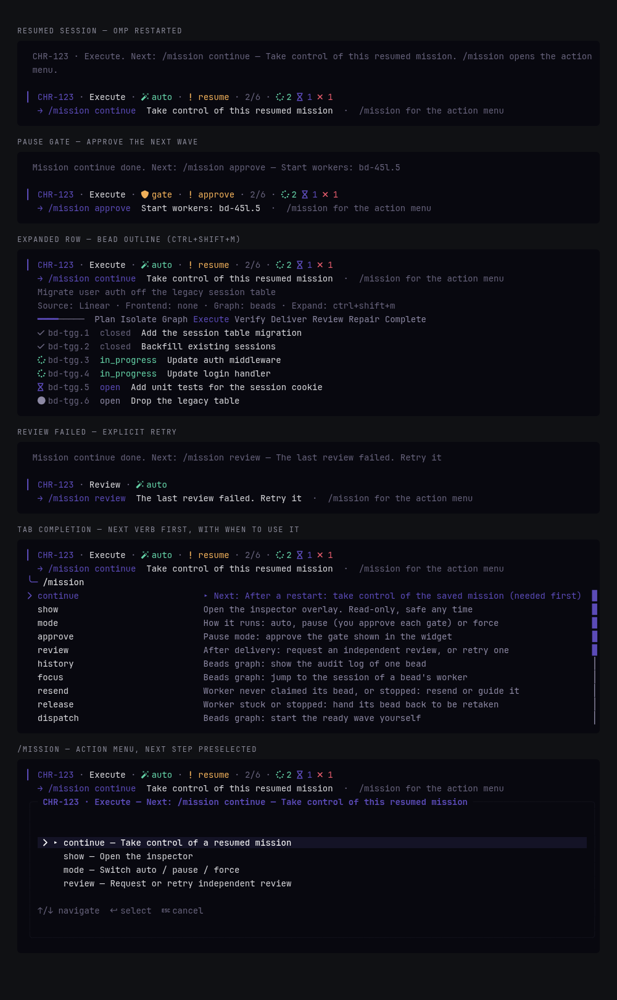

# omp-mission

Plan and run a ticket or task through verification and review. The row above the editor is the live state, and the line under it says what to run next.



OMP 18.4.4 or later. Restart OMP after install.

## Install

```text
/marketplace add Shadorain/omp-mission
/marketplace install mission@omp-mission
```

Or clone it into the extensions directory:

```bash
git clone https://github.com/Shadorain/omp-mission.git ~/.omp/agent/extensions/omp-mission
```

## Use

```text
/mission CHR-142
/mission owner/repo#123
/mission -- Fix the session cookie path
/mission CHR-142 --force --pause --keep
```

`--force` starts outside plan mode and requests review. `--pause` waits at each gate. `--keep` leaves worker tabs up.

```text
/mission show | config | history
```

**Not sure what to run? Type `/mission`.** On an active mission it opens the action menu: only commands valid right now, the next step first (`▸`) and preselected. Completed missions put `show` first and preselect it; `clear` remains an explicit start-over choice. `continue` is not a next-step command. It takes control of a saved mission after an OMP restart or resume, and until you run it `approve`, `review` and `dispatch` stay read-only (`review` and `mode` are queued and applied by `continue`).

Autocomplete keeps `show`, `config`, and `history` visible. `continue`, `approve`, `review`, `mode`, and `clear` appear only when relevant. Worker controls (`focus`, `resend`, `release`, `dispatch`, `reap`) stay out of the bare menu, but the one the widget recommends is listed there and in tab completion without selecting a bead first. The others remain directly callable.

**Past runs:** `/mission history` opens a read-only completed-mission browser. `/mission history <run-id>` opens a specific run; a ticket ID filters its completed runs. The bare `/mission` menu is commands and flags only. Ticket ids complete once you type a prefix. Browsing does not attach the archived run, change the active mission, or take controller ownership. Cleared runs remain in history. `/mission history <bead-id>` still shows an active mission bead's audit log.

**Start over:** `/mission clear` detaches a completed mission or discards an unstarted plan, including in plan mode. Saved mission history, beads, files, and external worker panes stay untouched. The cleared mission is excluded from lookup in this session, including after resume; `/mission` can then create a fresh plan with a new run ID. Clearing an unfinished saved mission is refused. Normal plan approval, Pause gates, and controller ownership still apply to the new run.

Saved-ticket lookup matches repository **and worktree path**, not just repository and ticket ID. A new worktree for the same ticket does not inherit an older worktree's completed mission.

The row under the mission summary shows the next action, for example `/mission continue` for a resumed mission, `/mission approve` at a Pause gate, or `/mission review` after a failed review. Commands appear only when the operator can act; quota blocks explain the prerequisite instead of offering a blind retry. Tab completion lists the next-step command first; worker-level recommendations remain in the action menu. Attaching a saved mission also prints the next step.

Commands you type run directly, with no model turn. Only model-initiated operations go through the `mission_control` tool and its native approval. Tool results are compact; the full source and worker assignments stay in the saved mission, not in context.

Tab completes the next argument. `ctrl+shift+m` expands the row. `ctrl+shift+f` opens the inspector. `ctrl+shift+o` cycles mode.

The compact row shows the ticket, phase, mode, and actionable status. Session names and rows omit source prefixes such as `linear:`; custom session names are preserved. Source, frontend, graph, native plan state, and the expand shortcut appear in the expanded row and inspector instead. The inspector hides the editor row while open. While a mission is visible, its configured expand key takes precedence over OMP's model-picker shortcut; without a mission, OMP keeps its normal key handling.

## Configuration

`~/.omp/agent/mission.json`. Bare `/mission config` displays the path and all configured values, including shortcuts. If the active mission uses a different graph, that graph is shown separately. A write says `Configuration set at ~/.omp/agent/mission.json: graph beads`.

```text
/mission config graph beads
/mission config frontend orca
/mission config frontend custom -- omp --print
/mission config modelRole slow
/mission config workerRole task
/mission config autoDispatch on
```

| Key | Default | |
| --- | --- | --- |
| `graph` | `local` | `local` works in this pane. `beads` is the durable worker graph. A running mission keeps the graph it started with. |
| `frontend` | `none` | `none`, `orca`, `herdr`, `custom`, or `subagent`. |
| `workerContext` | `project` | Context files a `subagent` worker loads: `project` (your `<agentDir>/AGENTS.md` plus the checkout's `AGENTS.md`, else `CLAUDE.md`), `all` (everything OMP discovers), or `none`. Context files ride in every request, so this is the largest fixed cost of a worker. |
| `reviewContext` | `project` | The same choice for review sessions. |
| `maxWorkers` | `2` | Integer from 1 through 8. |
| `modelRole` | `default` | OMP model role for the independent review session: `default` (the coordinator's own model), `slow`, `smol`, or any role in `modelRoles`. `@default` and `default` are the same. A role that does not name one available `provider/id` model falls back to the coordinator's model; the model used is recorded on each review round. |
| `workerRole` | `task` | Model role for bead workers, passed as `--model` for every frontend. A role with no configured model, or `default`, leaves workers on the default model. |
| `autoDispatch` | `false` | When on, ready waves in Auto and Force modes start without a model turn or per-wave tool approval. Pause mode, resume hold, plan mode, and lost ownership still stop it, and a failed attempt is handed to the coordinator. |
| `controls` | `false` | Inspector action button. `/mission actions` and other commands remain available either way. |
| `keys` | `ctrl+shift+m`, `ctrl+shift+f`, `ctrl+shift+o` | `expand`, `fullscreen`, `mode`. `null` turns one off. |

`PI_CODING_AGENT_DIR` or `OMP_AGENT_DIR` replaces `~/.omp/agent`.

## Orca workers

Workers receive the full multiline assignment through OMP's startup `@file` argument, not a composer paste. The assignment is short: bead, paths, rules. The ticket text is written once per mission to a shared file the worker reads only when the bead lacks context. `/mission focus <bead-id>` reads the persisted worker identity before switching tabs.

`/mission resend <bead-id>` sends a short instruction to read the assignment file. Input acceptance alone is not delivery: if Orca cannot confirm a started turn, inspect the worker tab before retrying. For an old worker with its assignment still pasted in the composer, submit that existing draft rather than pasting it again.

Restart or resume OMP after updating extension code. `/reload-plugins` does not reload extension factories.

A worker never stalls a mission silently. If its terminal disappears while the bead is unclaimed, the dead record is replaced automatically and the next action becomes `dispatch`. A live worker that has not claimed its bead within 3 minutes surfaces as `resend`, answered by one `resend` after inspecting the tab. A resume hold blocks both until `/mission continue`. Auto missions stop at delivery unless review was requested; run `/mission review` to continue into the independent review.

## Subagent workers

`/mission config frontend subagent` runs each bead in an in-process OMP session instead of a separate terminal or `omp -p` process. Beads graphs only. The session has file, shell, and search tools plus `yield`, no extensions, MCP, skills, or rules, and approvals are off (`yolo`). Sessions appear in the Agent Hub (`Alt+A`) as `<bead-id>`.

The extension, not the worker, owns `bd`. It claims the bead as the bead's own actor before the session starts. The worker returns `{done, summary, verification}` through the native yield tool. A launch baseline and mutating-tool traces attribute shared-checkout changes: unrelated sibling edits do not blame an innocent finisher, but attributed edits outside the worker's scope and unattributed changes outside all worker scopes leave its bead open.

A clean result stages only the worker's own changes and closes the bead with its summary and verification. `done: false`, a missing yield, or a failed `bd close` leaves the bead claimed and surfaces `resend` with the reason.

`/mission resend <bead-id> [guidance]` continues the same session with the rejection and guidance (a live session is steered). `/mission release <bead-id>` aborts it, unclaims the bead, and closes the worker record so a fresh worker can take the next dispatch.

Sibling scopes do not authorize a worker's own edits: mutating tools naming a changed file outside its assigned paths are rejected even when the sibling owning it is already closed. Scope checks attribute changes after execution; they are not a filesystem sandbox.

Sessions are saved under `missions/<workspace>/workers/`. After an OMP restart, once the session owns the mission and `/mission continue` has lifted the hold, a worker whose claim is still held resumes from its transcript (a session that cannot take ownership, or is still held, only observes; after a crash the old session's lock expires in 30 seconds); if the transcript is gone the claim is released and the bead is dispatched again. Closing OMP aborts live sessions and keeps their claims.

When multiple scoped beads are present, this frontend runs per-bead review in parallel, plus an integration pass for cross-bead defects on the first round. Overlapping scopes have one review owner: repair beads outrank originals, with the newest repair-link entry owning contested files. Findings carry their `beadId`. A citation outside that bead's owned files is moved to the owner, or dropped if no bead owns the path; it does not fail the target. Integration drops exact duplicate findings, not distinct defects at the same line. Later rounds re-review only beads whose owned files changed.

## Coordinator boundaries

In beads missions, implementation fixes belong to scoped worker leaves, not coordinator edits. Direct `edit`/`write` into the bound checkout is blocked, including new unbound files; `.artifacts/` remains available for evidence unless itself scoped. Blanket staging (`git add -A`, `git add .`, `git commit -a`) and recognized checkout-rewriting Git commands are blocked.

When all workers are closed and implementation leaves are complete, shell commands are checked against implementation-file fingerprints. Observed changes invalidate later evidence and hold verification; nothing is rolled back automatically. These checks are not a shell sandbox: concurrent workers, ignored build output, and commands that outlive their tool result limit attribution.


## Checkout and bead database

Approving the plan starts the mission automatically. If the checkout you are in already belongs to the ticket (its branch or path names it, as with an Orca worktree made for the issue), it is bound too, along with its bead database, and delivery defaults to `pr` for Linear and GitHub tickets. The coordinator is told the result and its next step in the same turn. A worktree is never created automatically.

Startup shows the ticket title and a readable specification-file path, not a ticket/JSON dump. The full ticket remains available to the coordinator. Pending plans recover from session metadata. Phase labels follow recorded verification and delivery, so a review-ready mission shows **Review**, not **Execute**.

The header labels dependency-waiting tasks as **waiting** with a neutral indicator. Only explicitly blocked beads use the error indicator; waiting for another worker is not a failed task.

A quota-exhausted reviewer stays blocked; restore provider quota or configure a funded review model before retrying `/mission review`. The extension never substitutes a reviewer or marks a failed review clean.

A failed `record_verification` is a durable hold. The model cannot record success or release it. After resolving the blocker, the operator runs `/mission continue`; verification becomes pending, not passed.


Linear checkout inference uses the first ticket identifier in each branch/path component. Later identifiers for the same project, or uppercase identifiers for other projects, still flag conflicts; lowercase title suffixes such as `chr-143-domain-error-2` do not create an `ERROR-2` ticket.

Approve the plan with **Approve and compact context** or **Approve and keep context**. **Approve and clear context** starts a new session, which loses the pending mission, so nothing starts; run `/mission` again there.

`mission_control bind_workspace` with no arguments does the isolate step in code: it reuses a checkout whose branch or path already names the ticket, or creates `mission/<slug>` in a sibling `<repo>-mission-<slug>` worktree from the primary checkout, then finds the canonical bead database and picks `pr` or `local` delivery. It stops with the reason when the base branch is unresolved, the branch or path is taken, or the checkout is a linked worktree for something else. A retry reuses the worktree it already made. It never runs `bd init`: a missing database is reported with the command. Passing `cwd`, `beadsDir`, `delivery`, or `base` overrides any default.

Base selection is explicit `bind_workspace base`, then repository `git config mission.baseBranch`, then written branch instructions (including “feature branches start from”), then GitHub's default branch or `origin/HEAD`. Pin an integration line with `git config mission.baseBranch v2/backend-rewrite`. Control/status results report the bound base; delivery must use it explicitly rather than assuming `main`.

## Review and repairs

Independent review results must match the verified revision and persisted field limits. Invalid results are rejected before they enter mission history.

The diff sent to the reviewer is capped (about 300 KB). Whole per-file sections are kept smallest first; files over the cap are listed in `omittedDiffs` and the reviewer reads them directly. A reviewer turn that errors or returns no text fails with its real cause (`Reviewer error: …`, `Reviewer returned no text`) instead of a JSON parse error.

The review diff is measured from the merge-base of `HEAD` and the bound base (preferring `origin/<base>`). Delivery and review read the PR's actual base with `gh pr view` and refuse a mismatch instead of silently adopting it. For a stacked PR, explicitly bind the stack's target before delivery. Verification and review fingerprints include the base, so retargeting requires fresh evidence; a same-byte commit on the same base still preserves the tree fingerprint. The reviewer's time budget is 5 minutes plus 15 seconds per changed file, capped at 30 minutes.

A requested review starts in the extension without a coordinator model turn as soon as it is ready: `/mission review`, a Force mission reaching review, a review request replayed by `/mission continue`, or `/mission approve` at the review gate in Pause. Progress and outcomes appear as notices. A failure remains blocked with its cause; `/mission review` explicitly retries it after prerequisites such as provider quota are resolved.

A malformed reviewer reply is sent back once in the same session with the reason. A reply that remains invalid fails the round with `[bead-id] <reason>`. Reviewers are instructed to use the full mission requirements and recorded repair/rejection decisions, and exclude cosmetic-only findings. Repair history does not silently settle distinct defects at the same location.

Each completed per-bead or integration result is checkpointed immediately. A timeout or another target's failure leaves the round incomplete, not clean. Retry reuses finished results only when the round, revision, model, prompt, inputs, and context still match. Progress survives restart and appears in the inspector. Older failed rounds without saved progress cannot recover their discarded results automatically.


Reviewers appear in Agent Hub while running and as `review <bead-id>` rows in the mission outline. Saved round transcripts and incomplete-round progress reconstruct completed and failed rows after restart; live rows replace their saved counterpart. Completed transcript paths remain in the inspector's evidence view under `~/.omp/agent/missions/<workspace>/reviews/<mission-id>/`; open one with `omp --resume <path>`. Older reviews without saved transcript or progress records cannot reconstruct individual rows.

Worker and reviewer sessions are saved but never recorded as the terminal's last session, so `omp -c` in the coordinator's terminal always resumes the coordinator and not a bead worker. A control result or `mission_status` that arrives while the extension is about to run a step itself (an auto dispatch or a review) says so and tells the coordinator to wait, instead of telling it to make a call that would fail with "Workers running" or "Mission operation already running".

`/mission approve` also runs the step it approves: at a wave gate it dispatches the wave, and at a repairs gate it accepts the repairs. Judgement stays with the coordinator: graph scopes, verification, delivery, repair work and rejecting findings.

When the latest independent review of the verified revision is clean, the extension marks the mission complete without a model turn. `record_delivery` accepts a commit of the verified files (same contents, new HEAD); any other edit after `record_verification` means verifying again. Workers get the approved plan as a file (`omp-mission-workers/<mission-id>.plan.md`) and are told to read only their slice.

Accepting local repairs advances the round and clears earlier verification and delivery. Passing verification requires changed output while actionable findings remain. Binding beads repair work, a different epic, unfinished leaves, or changed scopes clears verification, delivery, review, completion evidence and partial progress. Repair bindings advance the round; verification requires a nonempty graph whose implementation leaves are completed (`closed` or `done`).

Repair evidence becomes passed or failed with verification, rather than staying active through delivery. Explicitly rejecting every accepted finding skips repair evidence and allows unchanged output to be reverified. Delivery and independent rereview remain required for changed output.


## Develop

```bash
git clone https://github.com/Shadorain/omp-mission.git
cd omp-mission
bun install
bun test
bun run typecheck
```

## License

[MIT](LICENSE)
