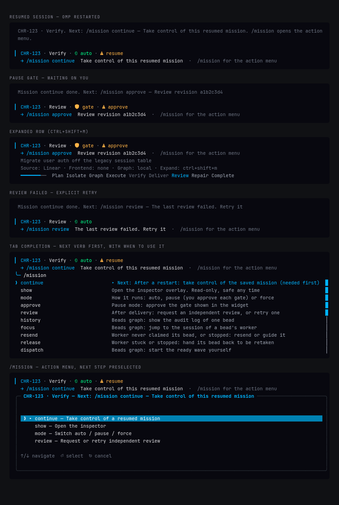

# omp-mission

Plan and run a ticket or task through verification and review. The row above the editor is the live state, and the line under it says what to run next.



OMP 18.4.4 or later. Restart OMP after install.

## Install

```text
/marketplace add Shadorain/omp-mission
/marketplace install mission@omp-mission
```

Or clone it into the extensions directory:

```bash
git clone https://github.com/Shadorain/omp-mission.git ~/.omp/agent/extensions/omp-mission
```

## Use

```text
/mission CHR-142
/mission owner/repo#123
/mission -- Fix the session cookie path
/mission CHR-142 --force --pause --keep
```

`--force` starts outside plan mode and requests review. `--pause` waits at each gate. `--keep` leaves worker tabs up.

```text
/mission show | continue | mode | approve | review
/mission history | focus | resend | reap | dispatch | actions | config
```

**Not sure what to run? Type `/mission`.** On an active mission it opens the action menu: only commands valid right now, the next step first (`▸`) and preselected. `continue` is not a next-step command. It takes control of a saved mission after an OMP restart or resume, and until you run it `approve`, `review` and `dispatch` stay read-only (`review` and `mode` are queued and applied by `continue`).

The row under the mission summary always says what is next, for example `→ /mission continue  Take control of this resumed mission`, `→ /mission approve  Start workers: bd-1, bd-2` at a Pause gate, or `→ /mission review  The last review failed. Retry it`. When the coordinator is working it shows a dim status instead, so a command is only offered when a person has to run it. Tab completion lists the same next verb first, and each verb's description says when to use it. Attaching a saved mission also prints the next step.

Commands you type run directly, with no model turn. Only model-initiated operations go through the `mission_control` tool and its native approval. Tool results are compact; the full source and worker assignments stay in the saved mission, not in context.

Tab completes the next argument. `ctrl+shift+m` expands the row. `ctrl+shift+f` opens the inspector. `ctrl+shift+o` cycles mode.

The compact row shows the ticket, phase, mode, and actionable status. Session names and rows omit source prefixes such as `linear:`; custom session names are preserved. Source, frontend, graph, native plan state, and the expand shortcut appear in the expanded row and inspector instead. The inspector hides the editor row while open. While a mission is visible, its configured expand key takes precedence over OMP's model-picker shortcut; without a mission, OMP keeps its normal key handling.

## Configuration

`~/.omp/agent/mission.json`. Bare `/mission config` displays the path and all configured values, including shortcuts. If the active mission uses a different graph, that graph is shown separately. A write says `Configuration set at ~/.omp/agent/mission.json: graph beads`.

```text
/mission config graph beads
/mission config frontend orca
/mission config frontend custom -- omp --print
/mission config modelRole slow
/mission config workerRole task
/mission config autoDispatch on
```

| Key | Default | |
| --- | --- | --- |
| `graph` | `local` | `local` works in this pane. `beads` is the durable worker graph. A running mission keeps the graph it started with. |
| `frontend` | `none` | `none`, `orca`, `herdr`, `custom`, or `subagent`. |
| `workerContext` | `project` | Context files a `subagent` worker loads: `project` (your `<agentDir>/AGENTS.md` plus the checkout's `AGENTS.md`, else `CLAUDE.md`), `all` (everything OMP discovers), or `none`. Context files ride in every request, so this is the largest fixed cost of a worker. |
| `reviewContext` | `project` | The same choice for review sessions. |
| `maxWorkers` | `2` | Integer from 1 through 8. |
| `modelRole` | `default` | OMP model role for the independent review session: `default` (the coordinator's own model), `slow`, `smol`, or any role in `modelRoles`. `@default` and `default` are the same. A role that does not name one available `provider/id` model falls back to the coordinator's model; the model used is recorded on each review round. |
| `workerRole` | `task` | Model role for bead workers, passed as `--model` for every frontend. A role with no configured model, or `default`, leaves workers on the default model. |
| `autoDispatch` | `false` | When on, ready waves in Auto and Force modes start without a model turn or per-wave tool approval. Pause mode, resume hold, plan mode, and lost ownership still stop it, and a failed attempt is handed to the coordinator. |
| `controls` | `false` | Inspector action button. `/mission actions` and other commands remain available either way. |
| `keys` | `ctrl+shift+m`, `ctrl+shift+f`, `ctrl+shift+o` | `expand`, `fullscreen`, `mode`. `null` turns one off. |

`PI_CODING_AGENT_DIR` or `OMP_AGENT_DIR` replaces `~/.omp/agent`.

## Orca workers

Workers receive the full multiline assignment through OMP's startup `@file` argument, not a composer paste. The assignment is short: bead, paths, rules. The ticket text is written once per mission to a shared file the worker reads only when the bead lacks context. `/mission focus <bead-id>` reads the persisted worker identity before switching tabs.

`/mission resend <bead-id>` sends a short instruction to read the assignment file. Input acceptance alone is not delivery: if Orca cannot confirm a started turn, inspect the worker tab before retrying. For an old worker with its assignment still pasted in the composer, submit that existing draft rather than pasting it again.

Restart or resume OMP after updating extension code. `/reload-plugins` does not reload extension factories.

A worker never stalls a mission silently. If its terminal disappears while the bead is unclaimed, the dead record is replaced automatically and the next action becomes `dispatch`. A live worker that has not claimed its bead within 3 minutes surfaces as `resend`, answered by one `resend` after inspecting the tab. A resume hold blocks both until `/mission continue`. Auto missions stop at delivery unless review was requested; run `/mission review` to continue into the independent review.

## Subagent workers

`/mission config frontend subagent` runs each bead in an in-process OMP session instead of a separate terminal or `omp -p` process. Beads graphs only. The session has file, shell, and search tools plus `yield`, no extensions, MCP, skills, or rules, and approvals are off (`yolo`). Sessions appear in the Agent Hub (`Alt+A`) as `<bead-id>`.

The extension, not the worker, owns `bd`. It claims the bead as the bead's own actor before the session starts. The worker yields `{done, summary, verification}`. The extension then compares the checkout against a baseline taken at launch: any file changed outside the bead's allowed paths (or the paths of other dispatched beads, whose own workers answer for them) leaves the bead open and names the files. A clean result stages the worker's own changes and closes the bead with the summary and verification as the close reason. `done: false`, a missing yield, or a failed `bd close` is reported and leaves the bead claimed. The next action becomes `resend` with the reason. `/mission resend <bead-id> [guidance]` continues the same session, with the rejection and your guidance as its prompt (a live session is steered). `/mission release <bead-id>` aborts it, unclaims the bead, and closes the worker record, so a fresh worker takes the bead on the next dispatch.

Sessions are saved under `missions/<workspace>/workers/`. After an OMP restart, once the session owns the mission and `/mission continue` has lifted the hold, a worker whose claim is still held resumes from its transcript (a session that cannot take ownership, or is still held, only observes; after a crash the old session's lock expires in 30 seconds); if the transcript is gone the claim is released and the bead is dispatched again. Closing OMP aborts live sessions and keeps their claims.

With this frontend, review runs one reviewer per bead on that bead's scoped diff, in parallel, plus one integration pass for cross-bead defects on the first round. Findings carry their `beadId`; the integration pass drops a finding a bead reviewer already reported on the same path and line. Later rounds re-review only beads whose owned files changed.

## Checkout and bead database

Approving the plan starts the mission automatically. If the checkout you are in already belongs to the ticket (its branch or path names it, as with an Orca worktree made for the issue), it is bound too, along with its bead database, and delivery defaults to `pr` for Linear and GitHub tickets. The coordinator is told the result and its next step in the same turn. A worktree is never created automatically.

Approve the plan with **Approve and compact context** or **Approve and keep context**. **Approve and clear context** starts a new session, which loses the pending mission, so nothing starts; run `/mission` again there.

`mission_control bind_workspace` with no arguments does the isolate step in code: it reuses a checkout whose branch or path already names the ticket, or creates `mission/<slug>` in a sibling `<repo>-mission-<slug>` worktree from the primary checkout, then finds the canonical bead database and picks `pr` or `local` delivery. It stops with the reason when the base branch is unresolved, the branch or path is taken, or the checkout is a linked worktree for something else. A retry reuses the worktree it already made. It never runs `bd init`: a missing database is reported with the command. Passing `cwd`, `beadsDir`, `delivery`, or `base` overrides any default.

## Review and repairs

Independent review results must match the verified revision and persisted field limits. Invalid results are rejected before they enter mission history.

The diff sent to the reviewer is capped (about 300 KB). Whole per-file sections are kept smallest first; files over the cap are listed in `omittedDiffs` and the reviewer reads them directly. A reviewer turn that errors or returns no text fails with its real cause (`Reviewer error: …`, `Reviewer returned no text`) instead of a JSON parse error.

Accepting local repairs advances the review round and clears earlier verification and delivery evidence. Passing verification requires changed output while actionable findings remain. Beads repairs advance the round when their finding-linked graph is bound; verification requires a nonempty graph whose implementation leaves are completed (`closed` or `done`).

Repair evidence becomes passed or failed with verification, rather than staying active through delivery. Explicitly rejecting every accepted finding skips repair evidence and allows unchanged output to be reverified. Delivery and independent rereview remain required for changed output.


## Develop

```bash
git clone https://github.com/Shadorain/omp-mission.git
cd omp-mission
bun install
bun test
bun run typecheck
```

## License

[MIT](LICENSE)
